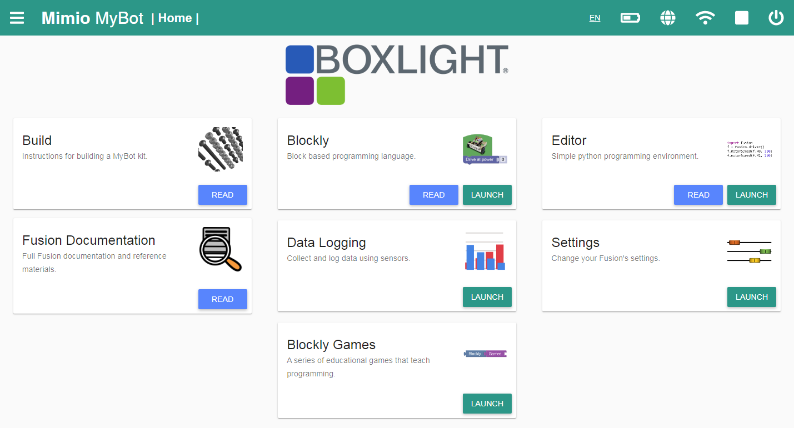
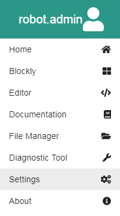

# **Web Interface**
-----
Program Development and operation of the Fusion System is all performed through a built-in Web-based Graphical User Interface (WebGUI). This section provides an overview of the Fusion Web Interface features and operations. It also includes links to the reference guides for the various environments you can use to develop programs or change settings on your Fusion.

## **Title Bar**  
>The Title Bar is displayed at the top of every page of Fusion Web Interface:  

>
>Clicking on the icon in the upper left  opens the **Hamburger Menu**:  
>

>
>>* The top of the Hamburger menu has the name of the current logged in account. For this example, we are logged in as the account named *robot.admin*.
>>* **Home** brings you back to the homepage of the Web Interface.
>>* **Blockly** brings you to the [Blockly](Blockly_Topic.md) programming environment.
>>* **Editor** brings you to the [Editor](Editor_Topic.md) text-based programming environment.
>>* **Documentation** opens the [Home Page](index.md) of the Fusion Documentation Suite.
>>* **File Manager** opens a simple file manager which allows you to perform basic file maintenance such as renaming, moving, and deleting files as well as copying them from the Fusion to your computer.
>>* **Diagnostic Tool** opens the Fusion [Diagnostic Tool](Diagnostic_Tool.md). This simple interface allows you to manually check the operation of your Fusion, sensors, motors, and other devices as well as obtain system status information.  this tool will almost always be used with the help of a support agent.
>>* **Settings** brings your to a page where you can update the Fusion, modify wireless settings and manage users. You must be logged in as Administrator to access this feature.
>>* **About** gives you [contact information](About.md) about Boxlight Robotics and MyBot.

>To the right of the Hamburger Menu icon is: .  The **Mimio MyBot** text is actually a clickable link which will take you back to the **Fusion Home Page**.  To the immediate right, the name of the current page is displayed.  
>
>On the far right side of the Title Bar are a series of icons. Clicking these icons provides status on each item:
>
>>* The **Language**  indicator shows the current language setting for the interface.  Clicking this indicator allows you to select from the available languages.  (Note that not all screens may be translated into the new language.)
>>* The **Battery**  icon which represents the remaining battery level of the [6V Fusion Battery](Connect_Battery.md).
>>* The **Internet** icon  informs you if you have an internet connection.
>>* The **Wireless** icon  provides information about the [wireless network](Connect_Internet.md) your Fusion may be connected to.  This is most valuable when connected to a Classroom Server such as the Mimio MicroCloud, or if an 802.11b/g/n USB Wi-Fi dongle is being used.
>>* The **Program Details** icon is either in Play  or Stop  status. Click the icon for additional details.
>>* The **Power** icon  allows you to **Logout**, **Power Off** or **Restart** your Fusion.   **You should always use this button to Power Off your Fusion after use**.  This insures all files are properly saved and prevents data loss. 

## **Home Screen**
>The Home Screen gives you options to access different parts of the Fusion Web Interface.
>
>>* **Build** brings you to available [building instructions](Robot_Building_Topic.md) for various Fusion kits.
>>* **Blockly** brings you to the [Blockly](Blockly_Topic.md) programming environment.
>>* **Editor** brings you to the [Editor](Editor_Topic.md) text-based programming environment.
>>* **Fusion Documentation** brings you to the to the [Home Page](index.md) of the Fusion Documentation.
>>* **Data Logging** Opens a simple [data logging application](Data_Logging_Tool.md) that allows you to take automatic readings of the Fusion Sensors over a period of time and export that information in a delimeted file for analysis..
>>* **Settings** brings your to a page where you can update the Fusion, modify wireless settings and manage users. *You **must** be logged in as an Admin User to access this feature*.
>>* **Blockly Games** opens a set of game-like activities to help you become familiar with using Blockly.

## **Additional Help**
>**1. [Find/Connect Fusion Access Point](AP_Find.md)**  
>**2. [Accessing the Fusion Web Interface](Accessing_Web_Interface.md)**  
>**3. [Create a new account](Account_Create.md)**  
>**4. [Delete an account](Account_Delete.md)**  
>**5. [Edit an account](Account_Edit.md)**  
>**6. [Change Fusion Access Point SSID and Passkey](AP_Change.md)**  
>**7. [Restore Fusion Access Point](AP_Restore.md#restore-ssid-and-passkey-via-the-web-interface)**  
>**8. [Connect to the Internet](Connect_Internet.md)**  
>**9. [Update the Fusion](Update.md)**  
>**10. [How to use Blockly](Blockly.md)**  
>**11. [How to use Editor](Editor.md)**  
>**12. [Using Autonomous Mode](Program_Autostart.md)**