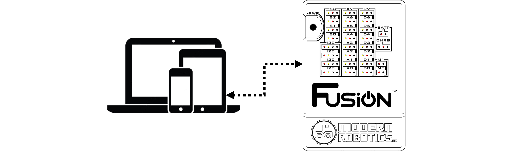

# **Wi-Fi Hub**
-----
The Fusion Controller acts as a Wi-Fi access point. Computers or phones can be used to search for local access points and find the Fusion Access Point by a unique SSID (name). Since the programming device (i.e. computer) is connected via Wi-Fi to the Fusion, there is no internet access.
>
>[How to connect to a Fusion Access Point](AP_Find.md)

If internet access is needed, a Wi-Fi dongle (available from Boxlight Robotics) can be connected to any of the available ports on the [USB Hub](USB_Hub.md). With the Wi-Fi dongle connected, the Fusion can connect to a wireless router.  
>
>#### [How to connect to the Internet](Connect_Internet.md)

## **Questions?**
>Contact Boxlight Robotics at [support@BoxlightRobotics.com](mailto:support@BoxlightRobotics.com) with a detailed description of the steps you have taken and observations you have made.
>
>**Email Subject**: Fusion Wi-Fi Hub