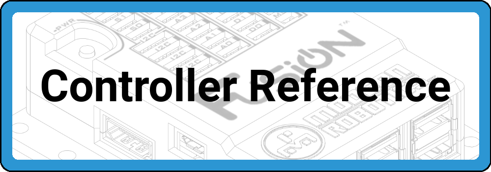
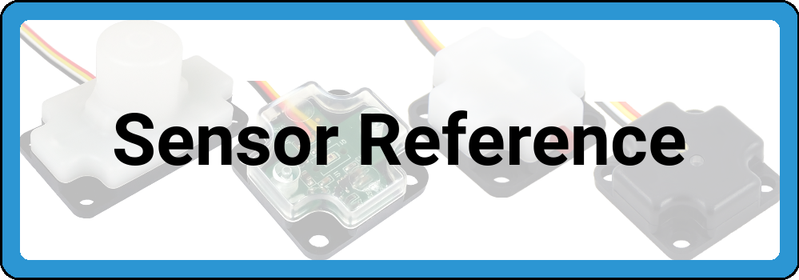
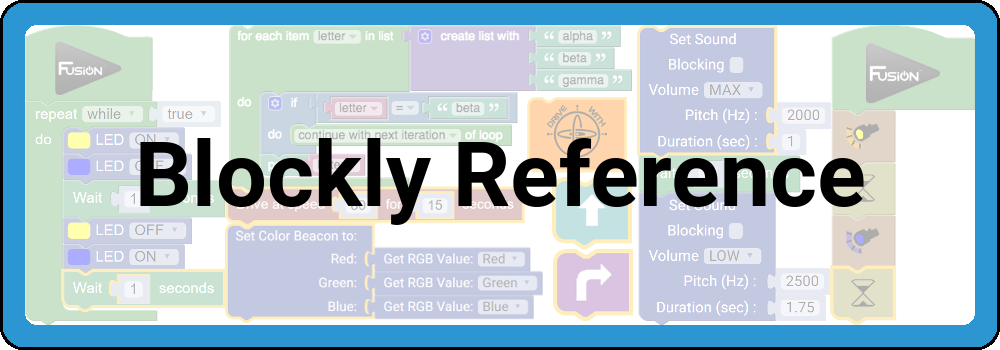
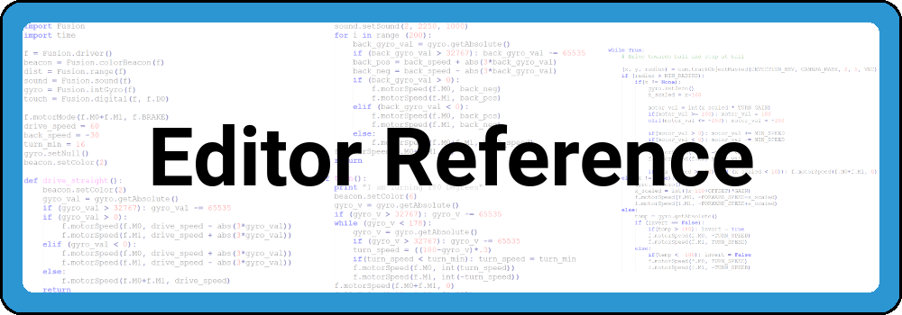
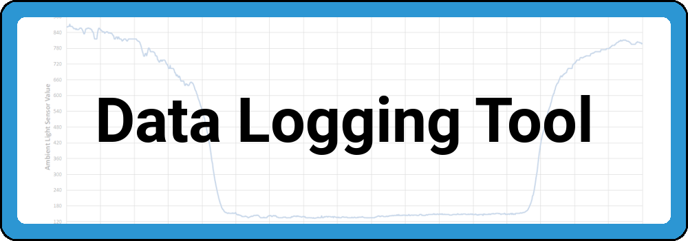
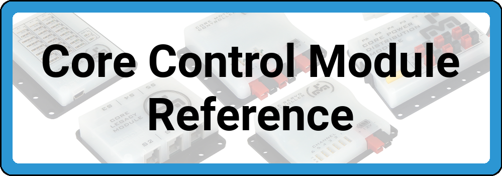
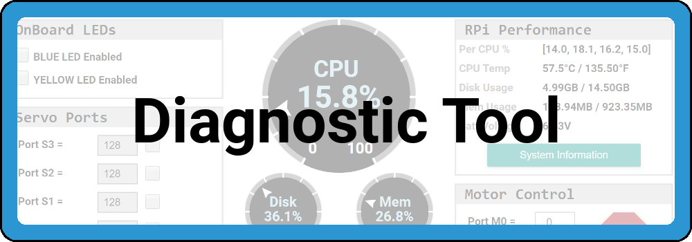
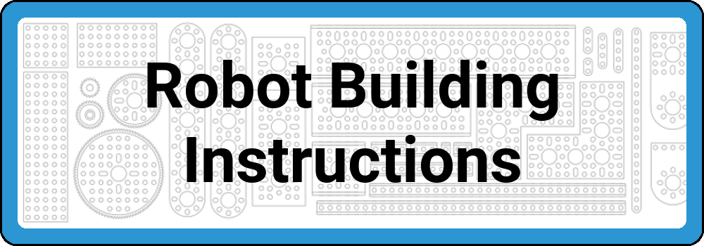

# **Welcome to the Fusion Documentation Suite**  
-----
>The Fusion Documentation Suite contains comprehensive user guides and reference materials so that you have all the important information right at your fingertips.  

>Use the ***Search Fusion Docs*** in the top right corner of the screen to search any questions you may have. If you can't find the solution to your problem, email us at [support@BoxlightRobotics.com](mailto:support@BoxlightRobotics.com).

## **Select from the topics below for more information**

 
 
[**About/Contact Boxlight Robotics**](About.md)